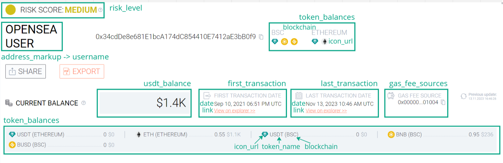

# AMLCrypto BTrace

**Содержание**
1. [Введение](#Introduction)
2. [data](#data)
    * [report_info](#report_info)
    * [address_overview](#address_overview)
    * [risk_level](#risk_level)
    * [risk_score_analyze](#risk_score_analyze)
    * [transactions_analyze](#transactions_analyze)
    * [transfers_analyze](#transfers_analyze)
    * [label_groups](#label_groups)
    * [counterparty_analyze](#counterparty_analyze)
    * [check_counterparty](#check_counterparty)
    * [pdf](#pdf)
3. [user](#user)
    * [social_rating](#social_rating)
    * [rating_points](#rating_points)
    * [connect](#connect)
    * [disconnect](#disconnect)
    * [remaining_checks](#remaining_checks)
    * [checks_history](#checks_history)
    * [report](#report)
    * [disconnect_address](#disconnect_address)
    * [get_connected_addresses](#get_connected_addresses)
    * [create_payment_link](#create_payment_link)
    * [create_fiat_id](#create_fiat_id)
    * [balance_history](#balance_history)
    * [promocode_activate](#promocode_activate)
    * [last_report_id](#last_report_id)
    * [referral_link](#referral_link)
    * [ref_link](#ref_link)
    * [referral_link_total_stats](#referral_link_total_stats)
    * [conversion_link_stats](#conversion_link_stats)
    * [reward](#reward)
    * [referral_details](#referral_details)
    * [reward_diagram](#reward_diagram)
    * [referrals_diagram](#referrals_diagram)
    * [achievements](#achievements)
    * [lessons](#lessons)
    * [lesson_step](#lesson_step)
4. [auth](#auth)
    * [connect](#auth_connect)
    * [login](#login)
    * [register](#register)
    * [check](#check)
    * [logout](#logout)
    * [wallet_connect](#wallet_connect)
    * [wallet_confirm](#wallet_confirm)
    * [vk](#vk)

## **Введение** <a id="Introduction"></a>

Данная документация служит описанием API BTrace (https://btrace.amlcrypto.io). Документация содержит все точки для взаимодействия frontend и backend приложений. В проекте используется *cookie-авторизация*, поэтому доступ к большинству эндпоинтов предоставляется лишь после прохождение авторизации.

Сайт оперирует двумя типами отчётов: бесплатными и платными, причём платные отчёты доступны только авторизованным пользователям. Некоторые эндпоинты предназначены только для платных отчётов. Далее платные отчёты будут также называться *полными*, а бесплатные *неполными*.

Все обращения к API происходят по адресу https://btrace.amlcrypto.io/api/v1.
API состоит из нескольких основных маршрутов: **data** — оперирует данными для отчётов по различным блокчейн-сетям, **user** — оперирует личным кабинетом пользователя, **auth** — включает в себя все эндпоинты для аутентификации и авторизации пользователей. Далее каждый из маршрутов и их эндпоинты рассматриваются по отдельности.

## **data** <a id="data"></a>
Для получения данных для отчётов используется маршрут https://btrace.amlcrypto.io/api/v1/data. Тело запроса, если не оговорено иное, выглядит следующим образом:
```json
{
    "address": "0x5026c2018BD1D244217D4305307D02502021CD63"
}
```
где **address** — исследуемый адрес в одной из следующих сетей: *Tron*, *Ethereum*, *BSC*, *Everscale*.

Ответ, если не оговорено иное, имеет структуру:
```json
{
    "address": "0x5026c2018BD1D244217D4305307D02502021CD63",
    "data": {
        ...
    }
}
```
1. Поле **address** содержит исследуемый адрес (тот же самый, что был отправлен в запросе);
2. Поле **data** соддержит вложенный `json` объект, структура которого зависит от эндпоинта;

Далее для каждого эндпоинта приводится описание ``json`` в поле **data**.

### **/report_info** <a id="report_info"></a>

Тип запроса: **POST**

Данный запрос возвращает информацию об отчёте в следующем формате:
```json
{
    "blockchain": "ethereum",
    "full_version": true
}
```
1. Поле **blockchain** содержит название сети, которой принадлежит адрес.
2. Поле **full_version** содержит значение **true**, если отчёт является полным, и **false** иначе.

### **/address_overview**  <a id="address_overview"></a>

Тип запроса: **POST**

Данный запрос доступен как в полной так и в неполной версиях отчёта.

В ответе в поле **data** возвращается `json` в следующем формате:
```json
{
    "usdt_balance": 4815162342,
    "gas_fee_sources": [
        {
            "address": "0xf0E582F4B4e08589BaAe1a525d74bD91598Cd80e",
            "network": "ethereum",
            "address_name": "",
            "icon_url": "url/to/icon/of/network"
        }
    ],
    "address_markup": {
        "username": "Gigachad",
        "address_names": [
            "Pockemon",
            "Gennadiy"
        ]
    },
    "first_transaction": {
        "date": "2020-02-05 18:20:56",
        "link": "https://etherscan.io/tx/0xdd9886d138f4e7bfc31966586ec60520f5fc395a84dafc90e057d7a316e232cb"
    },
    "last_transaction": {
        "date": "2023-04-27 12:13:23",
        "link": "https://etherscan.io/tx/0x902965ee671c535b6be624b17ca0b25f0f1e106c2fe314bdc11d85a7689bc4bc"
    },
    "token_balances": [
        {
            "token_name": "ETH",
            "blockchain": "ETH",
            "amount": 0.005636995004371576,
            "usdt_amount": 10.45,
            "icon_url": "url/to/icon/of/eth/token"
        },
        {
            "token_name": "USDT",
            "blockchain": "ETH",
            "amount": 4815162330.0,
            "usdt_amount": 4815162330.0,
            "icon_url": "url/to/icon/of/usdt/token"
        },
        {
            "token_name": "MATIC",
            "blockchain": "POLYGON",
            "amount": 1.488,
            "usdt_amount": 1.55,
            "icon_url": "url/to/icon/of/matic/token"
        }
    ]
}
```
1. **usdt_balance** содержит общий баланс всех токенов в *USDT* на адресе во всех исследуемых сетях (на данный момент поддерживается 2 EVM сети - ethereum и bsc).
2. **gas_fee_sources** содержит список вложенных ``json``-объектов, каждый из которых представляет собой информацию об источниках нативного токена для исследуемого адреса в конкретной сети (ehtereum/bsc). **gas_fee_sources -> icon_url** содержит либо ссылку на изображение, либо base64-строку с изображением, которое необходимо отобразить рядом с источником средств.
3. **address_markup** содержит разметку по исследуемому адресу; **username** — текущие имя адреса, а список **address_names** содержит имена, которые были назначены адресу ранее.
4. **first_transaction** и **last_transaction** содержат дату и время первой и последней транзакций соответственно, а также ссылки на эти транзакции в экспллорере (важно заметить, что в случае, когда у адреса нет транзакций поля **date** и **link** содержат значение "-").
5. **token_balances** содержит список с токенами, которыми владеет адрес. Поле **icon_url** содержит либо ссылку на изображение, либо base64-строку с изображением токена.

На рисунке ниже приведено сопоставление полей ответа элементам отчёта:


### **/risk_level**  <a id="risk_level"></a>

Тип запроса: **POST**

Данный запрос также доступен в бесплатной версии сервиса. Он необходим для указания уровня риска исследуемого адреса. В ответе в поле **data** возвращается `json` в следующем формате:
```json
{
    "risk_level": "Low"
}
```

Поле **risk_level** может содержать одно из трёх значений: **Low**, **Medium**, **High**.


### **/risk_score_analyze**  <a id="risk_score_analyze"></a>

Тип запроса: **POST**

Данный запрос доступен только в платной версии отчёта. В ответе содержится информация об уровне риска взаимодействия с исследуемым адресом, а также оси паутинки.

В ответе в поле **data** возвращается `json` в следующем формате:
```json
{
  "address": "string",
  "data": {
        "risk_level": "string",
        "risk_score": 0,
        "transactions": {
            "description": "string",
            "value": 0
        },
        "counterparty": {
            "description": "string",
            "value": 0
        },
        "social_rating": {
            "description": "string",
            "value": 0
        }
    }
}
```

Для платных отчётов, рекомендуется вместо отправки отдельного запроса [**risk_level**](#risk_level) для получения уровня риска в блоке **Overview**, отправлять сразу запрос **risk_score_analyze**.

На рисунке ниже приведено сопоставление полей ответа элементам отчёта:


### **/transactions_analyze**  <a id="transactions_analyze"></a>

Тип запроса: **POST**

Данный запрос доступен только в платной версии отчёта. В ответе содержится статистическая информация об активности адреса по часам/дням.

В ответе в поле [**data**](#Response) возвращается `json` в следующем формате:
```json
{
    "total_in": {
        "usdt_amount": 100,
        "txs_count": 4910
    },
    "total_out": {
        "usdt_amount": 58,
        "txs_count": 8000
    },
    "hour_activity": [
        {
            "hour": 0,
            "incoming_count": 4,
            "outgoing_count": 8
        },
        {
            "hour": 1,
            "incoming_count": 15,
            "outgoing_count": 16
        },
        {
            "hour": 2,
            "incoming_count": 23,
            "outgoing_count": 42
        },
        ...
        {
            "hour": 23,
            "incoming_count": 23,
            "outgoing_count": 42
        }
    ],
    "day_activity": [
        {
            "day_name": "Monday",
            "txs_count": 8800
        },
        {
            "day_name": "Thuesday",
            "txs_count": 555
        },
        ...
        {
            "day_name": "Saturday",
            "txs_count": 3555
        },
    ]
}
```

Список **hour_activity** содержит статистику по входящим/исходящим транзакциям за каждый час (0-23). Список **day_activity** содержит статистику по числу транзакций за каждый день недели (Monday, Tuesday, Wednesday, Thursday, Friday, Saturday, Sunday). Поля **total_in** и **total_out** содержат общий объём и число входящих/испходящих трнзакций соответственно.

На рисунке ниже представлено отображение возвращаемых полей на итоговый отчёт:


### **/transfers_analyze**  <a id="transfers_analyze"></a>

Тип запроса: **POST**

Данный запрос доступен только в платной версии отчёта. В ответе содержится информация о типах, с которыми взаимодействовал адрес. Данная информация необходима для отрисовки sunkey и бубликов.

В ответе в поле **data** возвращается `json` в следующем формате:
```json
{
    "types_diagram": {
        "diagram_in": [
            {
                "address": "",
                "name": "",
                "address_names": [
                    "string"
                ],
                "type": "string",
                "amount": 0
            }
        ],
        "diagram_out": [
            {
                "address": "",
                "name": "",
                "address_names": [
                    "string"
                ],
                "type": "string",
                "amount": 0
            }
        ]
    },
    "addresses_diagram": {
        "diagram_in": [
            {
                "address": "",
                "name": "",
                "address_names": [
                    "string"
                ],
                "type": "string",
                "amount": 0
            }
        ],
        "diagram_out": [
            {
                "address": "",
                "name": "",
                "address_names": [
                    "string"
                ],
                "type": "string",
                "amount": 0
            }
        ]
    }
}
```

Для отрисовки sunkey используются значения в поле **addresses_diagram**, а для отрисовки бубликов — **types_diagram**. **diagram_in** отвечает за входящие транзакции, а **diagram_out** — за испходящие. Максимальное число элементов в каждом из списков — 5. Каждый элемент списка содержит следующие поля:
1. **address** — адрес, с которым происходило взаимодействие.
2. **name** — текущее имя адреса, с которым происходило взаимодействие.
3. **address_names** — список исторических имён адреса.
3. **type** — тип адреса, с которым происходило взаимодействие.
4. **amount** — объём транзакций, постапивших на/с адрес(а) **address**.

На рисунках ниже представлено отображение возвращаемых полей на итоговый отчёт:


Цвета на диаграммах зависят от типов адресов. Всплывашка с дополнительными именами адреса появляется при наведении на красные кружочки.


### **/label_groups**  <a id="label_groups"></a>

Тип запроса: **POST**

Данный запрос доступен только в платной версии отчёта. В ответе на запрос содержится информация о некоторой разметке адреса и разметке его контрагентов.

В ответе в поле **data** возвращается `json` в следующем формате:
```json
{
    "counterparties": [
        {
            "name": "exchanges",
            "labels": []
        },
        {
            "name": "defi",
            "labels": []
        },
        {
            "name": "fraud",
            "labels": [
                "Deribit Exchange exploited 2022",
                "Tornado Cash Sanctions",
                "other"
            ]
        }
    ],
    "profile_analyze": [
        {
            "name": "wallet",
            "labels": ["MetaMask"]
        },
        {
            "name": "ens",
            "labels": []
        },
        {
            "name": "social",
            "labels": []
        }
    ]
}
```

Поля **counterparties** и **profile_analyze** содержат по три объекта, каждый из которых обозначает группу меток, содержащихся в списке **labels**.
В отчёте в разделе *Address Profile Analyse* содержатся блоки с именами *exchanges*, *defi*, *fraud*, *wallet*, *ens*, *social*, в которых нужно отобразить соответствующую группу меток:


### **/counterparty_analyze**  <a id="counterparty_analyze"></a>

Тип запроса: **POST**

Данный запрос доступен только для авторизованных пользователей и никак не относится к герерируемым отчётам. Запрос позволяет получить данные по контрагентам адреса, который пользователь привязал к личному кабинету. Полученные данные формируют следующую таблицу: **вставить таблицу**.

Запрос имеет следующий формат:
```json
{
    "address": "string",
    "page": 0,
    "page_size": 0,
    "sort_by": "string",
    "sort_order": "string",
    "filters": {
        "date": {
            "min": "string",
            "max": "string"
        },
        "risk": {
        "options": [
            "string"
        ]
        },
        "incoming": {
            "min": 0,
            "max": 0
        },
        "outgoing": {
            "min": 0,
            "max": 0
        }
    }
}
```

Ответ имеет следующий формат:
```json
{
    "unique": 0,
    "in": {
        "count": 0,
        "USDT": 0
    },
    "out": {
        "count": 0,
        "USDT": 0
    },
    "counterparty": {
        "page": 0,
        "pages": 0,
        "items": 0,
        "transactions": [
            {
                "address": "string",
                "address_name": "string",
                "in_USDT": 0,
                "out_USDT": 0,
                "risk_score": 0,
                "risk_level": "string",
                "report_id": "string",
                "date": "2023-11-09T15:48:42.156Z"
            }
        ]
    }
}
```

### **/check_counterparty**  <a id="check_counterparty"></a>

Тип запроса: **POST**

Данный запрос доступен только для авторизованных пользователей и никак не относится к герерируемым отчётам. Запрос используется для проверки одного из контрагентов (**ссылка на таблицу с контрагентами**).

Ответ содержит следующие поля:
```json
{
    "risk_level": "string",
    "risk_score": "string",
    "check_date": "2023-11-09T15:55:38.008Z",
    "report_id": "string"
}
```
1. **risk_score** и **risk_level** — числовое значение риска (от 1 до 100) и уровень риска (*Low, High, Medium*) соответственно.
2. **check_date** — даты проверки контрагента.
3. **report_id** — id сгенерированного отчёта (используется далее для получения отчёта по необходимости)

### **/pdf**  <a id="pdf"></a>

Тип запроса: **POST**

Данный запрос необходим для получения PDF-отчёта. В теле запроса передаётся одно из полей:
1. **address** — адрес, по которому необходимо получить последний отчёт.
2. **report_id** — id отчёта, который необходимо получить.


## **user** <a id="user"></a>
Для получения данных по аккаунту пользователя используется маршрут https://btrace.amlcrypto.io/api/v1/user.

### **/social_rating**  <a id="social_rating"></a>

Тип запроса: **GET**

Каждый авторизованный пользователь имеет свой социальный рейтинг, на который можно повлиять, о чём будет сказано далее. Данный запрос не имеет никаких параметров. В ответ на запрос приходит следующий ``json``:
```json
{
    "score": 0
}
```
где **score** — число от 0 до 100, обозначающее социальный рейтинг пользователя.

### **/rating_points**  <a id="rating_points"></a>

Тип запроса: **GET**

Каждый пользователь может повлиять на свой социальный рейтинг. Для этого ему необходимо подключить к личному кабинету один из аккаунтов *Github*, *Google*, *Twitter*, *LinkedIn*, *Discord* или же свой кошелёк *MetaMask*/*EverWallet*. За каждое подключение начисляется определённое количество баллов. Запрос **/rating_points** позволяет получить информацию об аккаунтах, которые можно подключить.

Ответ выглядит следующим образом:
```json
{
    "data": [
        {
            "name": "github",
            "points": 15,
            "done": false,
            "link": null,
            "icon": "..."
        },
        ...
    ]
}
```
Каждый элемент списка **data** состоит из следующих полей:
1. **name** — название приложения.
2. **points** — количество баллов, которое можно получить за подключение аккаунта данного приложения.
3. **done** — *true*, если приложение уже подключено, и *false* в противном случае.
4. **icon** — иконка приложения, которую необходимо отобразить на странице с подключением.


### **/connect**  <a id="connect"></a>

* Тип запроса: **GET**
* Параметр: **service**

Данный запрос предназначен для подключения приложений (*Github*, *Google*, *Twitter*, *LinkedIn*, *Discord*) и доступен только авторизованным полльзователям. Подключение происходит в соответствии со схемой **OAuth2.0**, причём все необходимые проверки и перенаправления происходят в бэкенд приложении.

В качестве параметра запроса передаётся название приложения, которое необходимо подключить. Например, для подключения *Github* необходимо обратиться по адресу https://btrace.amlcrypto.io/api/v1/user/connect/github. В ответ на запрос придёт редирект на страницу с подтверждением подключения, где пользователю будет необходимо дать разрешение на использование его персональных данных. После подтверждения или отказа пользователя проиходит перенаправление на страницу https://devbtrace.amlcrypto.io/socials, после чего фронтенд приложение обязано обновить данные по социальному рейтингу, отправив запросы [/user/social_rating](#social_rating) и [/user/rating_points](#rating_points).


### **/disconnect**  <a id="disconnect"></a>

* Тип запроса: **GET**
* Параметр: **service**

Если приложение привязано к личному кабинету пользователя, то на странице https://devbtrace.amlcrypto.io/socials пользователь имеет возможность его отключить. В качестве параметра запроса передаётся название приложения. Например, для того, чтобы отключить *Github*, необходимо обратитья по ссылке https://btrace.amlcrypto.io/api/v1/user/disconnect/github. В ответ на запрос приходит следующий ``json``:
```json
{
    "score": 0
}
```
где **score** — число от 0 до 100, обозначающее обновлённый социальный рейтинг пользователя.


### **/remaining_checks**  <a id="remaining_checks"></a>

* Тип запроса: **POST**

Как говорилось [ранее](#Introduction) существует два вида отчётов: платные и бесплатные. Данный запрос позволяет узнать количество платных отчётов, которые авторизованный пользователь может получить. С каждым новым отчётом это число уменьшается на единицу. В ответ на запрос приходит ``json`` в следующем формате:
```json
{
    "remaining_checks": 5
}
```
где **remaining_checks** обозначает число платных проверок у пользователя.


### **/checks_history** <a id="checks_history"></a>

* Тип запроса: **POST**

Данный запрос позволяет получить историю проверок авторизованного пользователя. Тело запроса выглядит следующим образом:
```json
{
    "page": 0,
    "page_size": 10,
    "sort_by": "string",
    "sort_order": "string",
    "filters": {
        "address": {
            "search": "string"
        },
        "risk": {
            "options": [
                "string"
            ]
        },
        "date": {
            "min": "string",
            "max": "string"
        }
    }
}
```
1. **page**, **page_size** — номер страницы и размер одной страницы.
2. **sort_by** — колонка, по которой необходимо произвести сортировку (допустимые значения: *address*, *date*).
3. **sort_order** — порядок сортировки (допустимые значения: *asc*, *desc*).
4. **filters -> address -> search** — адрес или паттерн, по которому необходимо фильтровать проверенные адреса.
5. **risk -> options** — список уровней риска, которые необходимо включить в поиск (*High*, *Medium*, *Low*); по умолчанию включены все уровни риска.
6. **date -> min/max** — временные рамки, в которые был сделан отчёт.

В ответ на запрос приходит ``json`` в следующем формате:
```json
{
    "page": 1,
    "pages": 5,
    "items": 10,
    "history": {
        "report_id": "string",
        "address": "string",
        "date": "2023-11-09T15:55:38.008Z",
        "risk_level": "string",
        "risk_score": 1,
    }
}
```
1. **page**, **pages**, **items** — номер страницы, общее количество страниц и число элементов на странице соответственно.
2. **history -> report_id** — id отчёта (необходимо для его получения).
3. **history -> address** — адрес, по которому была осуществлена проверка.
4. **history -> date** — дата проверки.
5. **history -> risk_level**, **history -> risk_score** — уровень риска и числовой показатель риска соответственно.


### **/report** <a id="report"></a>

* Тип запроса: **GET**

Любым сгенерированным отчётом можно поделиться с любым человеком. Для этого необходимо получить публичную ссылку на отчёт. Ссылка строится следующим образом: https://devbtrace.amlcrypto.io/report/{report_id}, где **report_id** — id отчёта. Например, https://devbtrace.amlcrypto.io/report/b3fd5460-553d-4c6b-bcb8-fb3b346b5b38.

Запрос */user/report* позволяет получить все необходимые для построения публичного отчёта данные. В ответ на запрос приходит ``json`` в следующем формате:
```json
{
    "address_overview": {
        ...
    },
    "transactions_analyze": {
        ...
    },
    "transfers_analyze": {
        ...
    },
    "counterparty_analyze": {
        ...
    },
    "risk_level": {
        ...
    },
    "risk_score_analyze": {
        ...
    },
    "info": {
        "lang": "string",
        "payment_method": "crypto"
    },
    "blockchain": "string",
    "address": "string",
    "current_report_id": "string",
    "created_at": "2023-11-05 03:31:25"
}
```
1. [**address_overview**](#address_overview), [**transactions_analyze**](#transactions_analyze), [**transfers_analyze**](#transfers_analyze), [**counterparty_analyze**](#label_groups), [**risk_level**](#risk_level), [**risk_score_analyze**](#risk_score_analyze) — содержат данные из поля **data** соответствующих запросов по маршруту */data*.
2. **address** — адрес, по которому сгенерирован отчёт.
3. **blockchain** — блокчейн, в котором был обнаружен адрес.
4. **current_report_id** — порядковый номер текущего отчёта.
5. **created_at** — дата генерации отчёта (дата проверки).


### **/disconnect_address** <a id="disconnect_address"></a>

* Тип запроса: **POST**

К личному кабинету пользователя [можно прикрепить криптокошелёк](#wallet_connect). Это можно сделать при регистрации или же в разделе с социальным рейтингом. Для открепления адреса от личного кабинета используется запрос */user/disconnect_address*. В теле запроса/отета передаётся/приходит единственное поле **address** — адрес, который необходимо открепить:
```json
{
    "address": "string"
}
```

Если данный адрес не прикреплён к личному кабинету, то вернётся ошибка 404 NotFound.


### **/get_connected_addresses** <a id="get_connected_addresses"></a>

* Тип запроса: **GET**

Для получения списка прикреплённых к личному кабинеу адресов используется запрос */user/get_connected_addresses*. В теле ответа содержится ``json`` в следуюющем формате:
```json
{
    "addresses": [
        "string"
    ]
}
```
где **addresses** — список адресов, прикреплённых к личному кабинету пользователя.


### **/create_payment_link** <a id="create_payment_link"></a>

* Тип запроса: **POST**

Сервис поддерживает криптовалютные опталы. Для создания ссылки на криптовалютную оплату используется запрос */user/create_payment_link*. Каждая ссылка является активной в течение часа, поэтому если пользователь запросил ссылку на оплату *N* проверок несколько раз в течение одного часа, ему будет возвращаться одна и та же ссылка.

Тело запроса должно содержать одно поле **checks** — количество проверок, закупаемых пользователем. В ответ на запрос приходит ``json`` в следующем формате:
```json
{
    "status": "string",
    "url": "string"
}
```
1. **url** — ссылка на оплату.
2. **status** — статус оплаты; данное поле может принимать одно из двух значений: *ok* — в случае, если была сгенерирована новая ссылка, *payment in progress* — если ссылка на оплату была сгенерирована одним из предыдущих запросов.

В случае, если платёжная система не отвечает продолжительное время, в ответ приходит ошибка 400 BadRequest.


### **/create_fiat_id** <a id="create_fiat_id"></a>

* Тип запроса: **POST**

Сервис также поддерживает фиатные платежи. Для таких платежей используется CloudPayments. Для подтверждения платежа необходимо знать стоимость покупки, количество проверок и invoce id — специальный идентификатор платежа. Для инициирования фиатной покупки используется запрос */user?create_fiat_id*. Тело запроса должно содержать одно поле **checks** — количество проверок, закупаемых пользователем. В ответ на запрос приходит ``json`` в следующем формате:
```json
{
    "invoice_id": "string",
    "rub": 0,
    "count_check": 0
}
```
1. **invoice_id** — уникальный идентификатор платежа.
2. **rub** — сумма покупки в рублях.
3. **count_check** — количество приобретаемых проверок.

После осуществления покупки CloudPayments обращается к специальному вебхуку, который сверяет данные по оплате и обновляет состояние.


### **/balance_history** <a id="balance_history"></a>

* Тип запроса: **POST**

Данный запрос возвращает информацию по приобретённым и израсходованным проверкам. По полученным данным строится таблица, каждая запись которой состоит из числа израсходованных/приобретённых проверок, даты приоретения/использования проверок и комментария.

Тело запроса представляет собой ``json`` следоющего формата:
```json
{
    "page": 0,
    "page_size": 10,
    "sort_by": "string",
    "sort_order": "string",
    "filters": {
        "date": {
            "min": "string",
            "max": "string"
        },
        "status": {
            "options": [
                "string"
            ]
        }
    }
}
```
1. **page**, **page_size** — номер страницы и размер одной страницы.
2. **sort_by** — колонка, по которой необходимо произвести сортировку (допустимые значения: *date*, *receipts*).
3. **sort_order** — порядок сортировки (допустимые значения: *asc*, *desc*).
4. **date -> min/max** — временные рамки, в которые был сделан отчёт.
5. **filters -> status -> options** — статус полпонений (*complete*, *pending*, *expired*).

В ответ на запрос приходит ``json`` в следующем формате:
```json
{
    "page": 1,
    "pages": 5,
    "items": 10,
    "history": {
        "comment": "string",
        "date": "2023-11-09T15:55:38.008Z",
        "status": "string",
        "expenses": 0,
        "receipts": 0
    }
}
```
1. **page**, **pages**, **items** — номер страницы, общее количество страниц и число элементов на странице соответственно.
2. **history -> comment** — комментарий, описывающий покупку/проверку.
3. **history -> date** — дата покупки/проверки.
4. **history -> status** — статус оплаты (*complete*, *pending*, *expired*).
5. **history -> expenses**, **history -> receipts** — количество затраченных/приобретённых проверок соответственно.


### **/promocode_activate** <a id="promocode_activate"></a>

* Тип звпроса: **POST**

Для активации промокодов используется запрос */user/promocode_activate*, в теле которого передается одно поле **promocode**. В ответ приходит ``json`` с полем **message**, в котором передаётся сообщение об активации промокода на *N* проверок.


### **/last_report_id** <a id="last_report_id"></a>

* Тип звпроса: **GET**
* Параметр: **address**

Данный запрос позволяет получить последний сгенерированный пользователем отчёт по конкретному адресу. В качестве параметра запроса необходимо передать адрес, по которому следует получить отчёт. В ответ приходит ``json`` с полем **report_id**, в котором содержится uuid4-строка — id отчёта.


### **/referral_link** <a id="referral_link"></a>

* Тип звпроса: **GET**

Данный запрос используется для генерации реферальной ссылки. При каждом новом запросе генерируется новая ссылка. В теле ответа возаращается поле **referral_link**, содержащее сгенерированную ссылку.


### **/ref_link** <a id="ref_link"></a>

* Тип звпроса: **POST**

На сайте ведётся подсчёт переходов и регистраций по реферальным ссылкам. Если пользователь перешёл по некоторой реферальной ссылке *link*, то для этой ссылки необходимо обновить статистику. Для этого необходимо отправить запрос */user/ref_link*, в теле которого указать по какой реферальной ссылке был осуществлён переход:
```json
{
    "referral_link": "string"
}
```


### **/referral_link_total_stats** <a id="referral_link_total_stats"></a>

* Тип звпроса: **GET**

В личном кабинете пользователь может узнать информацию о возможных начислениях за реферальную программу. Для этого используется запрос */user/referral_link_total_stats*. В ответ на запрос возвращается ``json``-объект в следующем формате:
```json
{
    "links": [
        "string"
    ],
    "available_reward": 0.0,
    "total_reward": 0.0,
    "total_withdraw": 0.0
}
```
1. **links** — список всех реферальных ссылок, которые были сгенерированы пользователем.
2. **available_reward** — доступное пользователю вознаграждение в долларах.
3. **total_reward** — общее вознаграждение за всё время.
4. **total_withdraw** — выплаченное вознаграждение за всё время.


### **/conversion_link_stats** <a id="conversion_link_stats"></a>

* Тип звпроса: **POST**

Для получения конверсии по ссылкам используется запрос */user/conversion_link_stats*. Тело запроса выглядит следующим образом:

```json
{
    "page": 0,
    "page_size": 10,
    "sort_by": "string",
    "sort_order": "string",
    "filters": {
        "clicks": {
            "min": 0,
            "max": 0
        },
        "registrations": {
            "min": 0,
            "max": 0
        },
        "conversion": {
            "min": 0,
            "max": 0
        },
        "reward": {
            "min": 0,
            "max": 0
        }
    }
}
```
1. **page**, **page_size** — номер страницы и размер одной страницы.
2. **sort_by** — колонка, по которой необходимо произвести сортировку (допустимые значения: *clicks*, *registrations*, *conversion*, *reward*).
3. **sort_order** — порядок сортировки (допустимые значения: *asc*, *desc*).
4. **filters** — вложенный ``json``, поля которого используются для фильтрации таблицы; для каждого поля (**clicks**, **registrations**, **conversion**, **reward**) можно выставить отрезок, в который должны попадать его значения.

В ответ приходит ``json`` в следующем формате:
```json
{
    "page": 0,
    "pages": 1,
    "items": 0,
    "data": [
        {
            "link": "string",
            "clicks": 0,
            "registrations": 0,
            "conversion": 0.0,
            "reward": 0.0
        }
    ],
    "total": {
        "link": "string",
        "clicks": 0,
        "registrations": 0,
        "conversion": 0.0,
        "reward": 0.0
    }
}
```
1. **page**, **pages**, **items** — номер страницы, общее количество страниц и число элементов на странице соответственно.
2. **data** — список, каждый элемент которого содержит статистику по одной из реферальных ссылок **data -> link**.
3. **clicks**, **registrations** — число переходов и регистраций по реферальной ссылке.
4. **conversion** — процентное отношение числа регистраций к переходам.
5. **reward** — вознаграждение, заработанное по реферальной ссылке.
6. **total** — общая статистика по всем реферальным ссылкам пользователя; **total -> link** всегда равно пустой строке.


### **/reward** <a id="reward"></a>

* Тип звпроса: **POST**

Для получения информации о выплатах используется запрос */user/reward*. Тело запроса выглядит слеюующим образом:
```json
{
    "page": 0,
    "page_size": 10,
    "sort_by": "string",
    "sort_order": "string",
    "filters": {
        "date": {
            "min": "string",
            "max": "string"
        },
        "amount": {
            "min": 0,
            "max": 0
        },
        "status": {
            "options": [
                "string"
            ]
        }
    }
}
```
1. **page**, **page_size** — номер страницы и размер одной страницы.
2. **sort_by** — колонка, по которой необходимо произвести сортировку (допустимые значения: *date*, *amount*, *status*).
3. **sort_order** — порядок сортировки (допустимые значения: *asc*, *desc*).
4. **filters** — вложенный ``json``, поля которого используются для фильтрации таблицы; **date** и **amount** — для указания временного и числового отрезка, **status** — список статусов, которые необходимо показать (возможные значения: *requested*, *expected*, *paid*, *rejected*).

В качевте ответа приходит ``json``-объект в следующем формате:
```json
{
    "page": 0,
    "pages": 1,
    "items": 0,
    "data": [
        {
            "date": "2023-11-09T15:48:42.156Z",
            "amount": 0.0,
            "status": "string",
        }
    ]
}
```
1. **page**, **pages**, **items** — номер страницы, общее количество страниц и число элементов на странице соответственно.
2. **data** — список элементов, каждый из которых представляет собой запись в таблице: **date** — дата и время события, **amount** — количество полученных/выплаченных средств, **status** — статус выплаты.


### **/referral_details** <a id="referral_details"></a>

* Тип звпроса: **POST**

Для получения детальной статистики по реферальным ссылкам используются запрос */user/referral_details*. Тело запроса имеет следующий формат:
```json
{
    "page": 0,
    "page_size": 10,
    "sort_by": "string",
    "sort_order": "string",
    "filters": {
        "date": {
            "min": "string",
            "max": "string"
        },
        "amount": {
            "min": 0,
            "max": 0
        },
        "reward": {
            "min": 0,
            "max": 0
        },
        "status": {
            "options": [
                "string"
            ]
        }
    }
}
```
1. **page**, **page_size** — номер страницы и размер одной страницы.
2. **sort_by** — колонка, по которой необходимо произвести сортировку (допустимые значения: *date*, *status*, *amount*, *reward*).
3. **sort_order** — порядок сортировки (допустимые значения: *asc*, *desc*).
4. **filters** — вложенный ``json``, поля которого используются для фильтрации таблицы; **date**, **amount** и **reward** — для указания временного и числовых отрезков, **status** — список статусов, которые необходимо показать (возможные значения: *registered*, *used*, *bought*).

В ответ на запрос приходит ``json`` в следующей формате:
```json
{
    "page": 0,
    "pages": 1,
    "items": 0,
    "data": [
        {
            "date": "2023-11-09T15:48:42.156Z",
            "user": "string",
            "status": "string",
            "amount": 0.0,
            "reward": 0.0
        }
    ]
}
```
1. **page**, **pages**, **items** — номер страницы, общее количество страниц и число элементов на странице соответственно.
2. **data** — список элементов, каждый из которых представляет собой запись в таблице; **date** — дата и время события, **amount** — количество полученных средств, **reward** — количество выплаченных средств, **status** — статус пользователя, **user** — хэш пользователя.


### **/reward_diagram** <a id="reward_diagram"></a>

* Тип звпроса: **POST**

Данный запрос используется для получения диаграммы выплат. Тело запроса имеет следующий формат:
```json
{
    "group": "string",
    "link": "string",
    "date": {
        "min": "string",
        "max": "string"
    }
}
```
1. **group** — поле для группировки; возможные значения: *day*, *month*.
2. **link** — реферальная ссылка; по умолчанию *null*, что означает, что необходимо построить диаграмму по всем реферальным ссылкам пользователя.
3. **date -> min/max** — фильтр для указания временного окна.

В ответ на запрос приходит ``json``-объект в следующем формате:
```json
{
    "group": "string",
    "data": [
        {
            "date": "2023-11-09T15:48:42.156Z",
            "reward": 0.0,
            "conversion": 0.0,
        }
    ]
}
```
1. **group** — то же, что и в запросе.
2. **data** — список, каждый из которых состоит из 3-х полей: **date** — дата, на которую расчитана статистика (для группировки по месяцам указывается первый день мясяца), **reward** — вознаграждение, **conversion** — процентное отношение числа оплат пользователей, зарегистрировавшихся по реферальной ссылке, к числу переходов по этой ссылке.


### **/referrals_diagram** <a id="referrals_diagram"></a>

* Тип звпроса: **POST**

Для получения статистической диаграммы по реферальной ссылке используется запрос */user/referrals_diagram*. В теле запроса необходимо пробросить одно поле: **referral_link**. Если не указывать реферальную ссылку, по которой необходимо построить диаграмму, то возвращаются обобщённые дынные по всем ссылкам.

В ответ на запрос возвращается ``json``-объект в следующем формате:
```json
{
    "data": [
        {
            "date": "2023-11-09T15:48:42.156Z",
            "clicks": 0,
            "registrations": 0,
            "payments": 0,
        }
    ]
}
```
1. **data** — список, каждый элемент которого состоит из 4-х полей: **date** — дата, на которую рассчитана статистика, **clicks**, **registrations**, **payments** — число кликов, регистраций, платежей по реферальной ссылке соответственно.


### **/achievements** <a id="achievements"></a>

Тип запроса: **GET**

Данный запрос возращает ачивки, которые получил пользователь, пользуясь Btrace'ом

**name** всех ачивок - название ачивок на русском - смысл ачивки

1. **expert_btc** - Знаток Bitcoin - за проверку 10 адресов Bitcoin
2. **expert_evm** - Знаток Ethereum & BSC - за проверку 10 адресов Ethereum или BSC
3. **expert_ever** - Знаток Everscale - за проверку 10 адресов Everscale
4. **expert_tron** - Знаток Tron - за проверку 10 адресов Tron
5. **expert_blockchain** - Исследователь блокчейна - За проверку по 10 адресов в каждом из сетей Bitcoin, Ethereum / BSC, Tron, Everscale
6. **bad_counterparties** - Гроза недобропорядочных контрагентов - За проверку 10 адресов с типом Phishing, Stolen Coins, Hacking, Terrorism Financing Ransom, Malware, Sanctions, Darknet
7. **expert_mixer** - Спец по Миксерам - 3 адреса, принадлежащих миксерам
8. **expert_cex** - CEX Эксперт - 5 адресов, принадлежащих Centralized Exchange


В ответ приходит ``json`` в следующем формате:

```json
{
    "data": [
        {
            "name": "expert_btc",
            "status": true,
            "percent": 100
        }
    ]
}
```

1. **name** - имя ачивки
2. **status**  - статус получения ачивки. Если ачивка заработана - `true`, иначе `false`
3. **percent** - процент получения ачивки. *0* - ачивка еще не начата, *100* - пользователь получил ачивку


### **/lessons** <a id="lessons"></a>

Типа запроса: **GET**

Данный запрос возращает *номер шага*, на котором находится пользователь. Если пользователь не проходил определенный урок, то для него значение `step` будет равно 0.

**name** урока - название урока на русском

1. **crypto** - Вводный урок. О криптовалюте и почему это актуально для каждого
2. **blockchain** - Урок 1. Что такое блокчейн
3. **address** - Урок 2. Что такое адрес
4. **tokens** - Урок 3. Токены
5. **networks** - Урок 4. Сети
6. **consensus** - Урок 5. Консенсус
7. **choose_blockchain** - Урок 6. Как выбрать блокчейн
8. **buy_crypto** - Урок 7. Где купить, обменять криптовалюту
9. **earn_money** - Урок 8. Как заработать в блокчейне
10. **security** - Урок 9. Безопасность в блокчейне

В ответ возвращается `json` в следующем формате:

```json
{
    "data": [
        {
            "name": "tokens",
            "step": 2
        }
    ]
}
```

1. **name** - имя урока.
2. **step**  - номер шага, на котором находится пользователь.


### **/lesson_step**

Типа запроса: **POST**

Данный запрос необходим для получения информации о том, какой шаг **прошёл** пользователь. Если пользователь вернулся на два шага назад (если такое будет возможно), отправлять ранее пройденные номера шагов НЕ НАДО! Шаги проходятся **строго** в последовательном порядке, т.е. нельзя с шага 2 перескочить на шаг 7!

Формат запроса:
```json
{
    "name": "tokens",
    "step": 3
}
```

1. **name** - имя урока, который **проходит** пользователь.
2. **step**  - номер шага, который **прошел** пользователь.

Формат ответа:

```json
{
    "name": "tokens",
    "step": 3
}
```

1. **name** - имя урока, который **проходит** пользователь (записанный в БД).
2. **step**  - номер шага, который **прошел** пользователь (записанный в БД).


## **auth** <a id="auth"></a>

Данный маршрут используется для авторизации пользователей.

### **/connect** <a id="auth_connect"></a>

* Тип звпроса: **GET**

Данный запрос работает по тому же принципу, что и [*/user/connect*](#connect)


### **/login** <a id="login"></a>

* Тип звпроса: **POST**

Данный запрос используется для авторизации пользователя через почту/username и пароль. В теле запроса прокидывается 2 поля: **username** и **password**.


### **/register** <a id="register"></a>

* Тип звпроса: **POST**

Данный запрос используется для регистрации пользователя по почте и паролю. Тело запроса выглядит следующим образом:
```json
{
    "email": "string",
    "username": "sting",
    "password": "sting",
    "referral_link": "string"
}
```
где **email**, **username**, **password** — почта, ник пользователя и пароль соответственно, а **referral_link** — реферальная ссылка, по которой пользователь попал на сайт.


### **/check** <a id="check"></a>

* Тип звпроса: **POST**

Данный запрос используется для проверки на то, авторизован пользователь или нет. Если пользователь авторизован, в ответ приходит ``json`` с полем **username**,  в противном случае — ошибка 401.


### **/logout** <a id="logout"></a>

* Тип звпроса: **POST**

Данный запрос используется для очищения cookie-сессии, когда пользователь покидает приложение.


### **/wallet_connect** <a id="wallet_connect"></a>

* Тип звпроса: **POST**

Данный запрос используется для подключения криптокошелька к личному кабинету пользователя. В теле запроса в поле **wallet** необходимо передать название подключаемого кошелька. Поддерживаемые кошельки: *MetaMask*, *TrustWallet*, *EverWallet*. В ответе приходит единственное поле: *nonce*. Данное значение и адрес пользователя (адрес, который пользователь хочет подключить к личному кабинету) используются для в сообщении для подписи.
Подписываемое сообщение имеет следующее содержание: *Welcome to Btrace by AML Crypto!\n\nClick the button below to accept Terms of Service and Privacy Policy.\n\nYour wallet connection won't trigger blockchain transaction, so it's free to connect.\n\nWallet address:\n{address}\n\nNonce:\n{nonce}*, — где вместо *{address}* и *{nonce}* необходимо подставить соответствующие значения.

Например, при подключении *MetaMask* картина будет выглядеть следующим образом:

<p align="center">
    
</p>


### **/wallet_confirm** <a id="wallet_confirm"></a>

* Тип звпроса: **POST**

После того, как пользователь подписал сообщение, необходимо отправить запрос на аутентификацию через кошелёк — */auth/wallet_confirm*. Тело запроса выглядит следующим образом:
```json
{
    "signature": "string",
    "address": "string",
    "referral_link": "string",
    "public_key": "string"
}
```
1. **signature** — подпись, генерируемая кошельком.
2. **address** — привязываемый к личному кабинету адрес.
3. **referral_link** — реферальная ссылка, по которой пользователь перешёл на сайт; по умолчанию это поле содержит значение **null** (если пользователь не использовал реферальную ссылку).
4. **public_key** — публичный ключ пользователя; используется только для *EverWallet*, по умолчанию **null**.

В ответ на запрос приходит ``json`` с полем *ok*, которое содержит значение *true*, если привязка кошелька прошла успешно, и *false* иначе. Также при успешной привязке (если пользователь осуществил вход при помощи кошелька) устанавливается сессия cookie, которая используется в дальнейшем для авторизации пользователя.

### **/vk** <a id="vk"></a>

* Тип звпроса: **POST**

Для передачи параметров запуска приложения *vk mini apps* используется запрос */api/v1/auth/vk*. В заголовке запроса необходимо передать поле **xvk** со значением строки параметров пользователя. Например, значение поля **xvk** может выглядеть так:
```json
vk_user_id=494075&vk_app_id=6736218&vk_is_app_user=1&vk_are_notifications_enabled=1&vk_language=ru&vk_access_token_settings=&vk_platform=android&sign=htQFduJpLxz7ribXRZpDFUH-XEUhC9rBPTJkjUFEkRA
```
Стоит обратить внимание, что аргументы **vk_user_id** и **sign** являются обязательными.

В ответном запросе пользователю выставится куки-сессия, благодаря которой он будет считаться авторизованным. Если подпись в заголовке не совпадает с получившейся на сервере подписью, то возвращается статус 400. Если авторизация не прошла по иным причинам, то возвращается статус 401.


